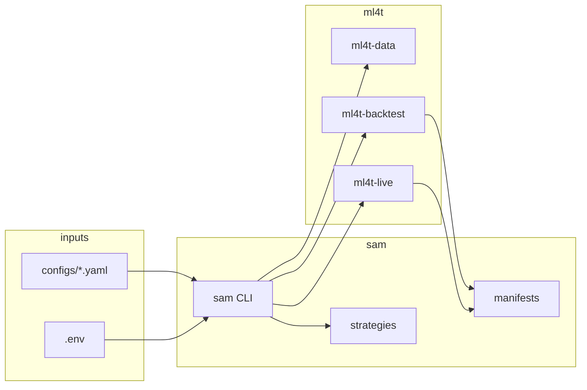

# SAM

SAM is a production trading orchestration layer on the [ML4T](https://github.com/orgs/ml4t/repositories) libraries. **SAM orchestrates; ML4T computes, validates, backtests, and executes.** SAM owns configs, CLI routing, strategy selection, manifests, and operator workflow only.

## Documentation

| Doc | Description |
|-----|-------------|
| [Architecture](docs/ARCHITECTURE.md) | Layers, data flow, promotion lifecycle (with diagrams) |
| [Runbook](docs/RUNBOOK.md) | Operator promotion checklist and drills |
| [Contributing](CONTRIBUTING.md) | Dev setup, tests, PR expectations |

## Architecture (overview)



Promotion path: `research` → `backtest_passed` → `shadow` → `paper` → `live`. Details and sequence diagrams are in [docs/ARCHITECTURE.md](docs/ARCHITECTURE.md).

## Prerequisites

- Python 3.12+
- [uv](https://docs.astral.sh/uv/) recommended (or pip)

## Install

ML4T libraries are installed from [PyPI](https://pypi.org/search/?q=ml4t-).
`uv.lock` pins the resolved package set for reproducible local and CI installs.

```bash
cd sam
uv sync --extra backtest --extra live --extra data --group dev
# Full stack (research pulls numba/llvmlite; may require CMake):
# uv sync --extra all --group dev
# or: pip install -e ".[all]"
cp .env.example .env
```

## Quick start

```bash
# Generate test fixture (committed in repo; re-run to refresh)
uv run python scripts/generate_fixtures.py

# Backtest MA crossover on fixture data
sam backtest run --config configs/backtest/ma_baseline.yaml

# Offline data validation (no network)
sam data validate --config configs/data/validate_fixtures.yaml

# Shadow mode (no broker, synthetic feed)
sam live shadow --config configs/live/ma_baseline.yaml --duration 30

# Dry-run order preview (no engine or broker connection)
sam live preview --config configs/strategies/ma_crossover.yaml --bars 20

# Alpaca paper (requires keys in .env)
sam live paper --config configs/live/ma_baseline.yaml --duration 95

# Data sync (network; Yahoo by default)
sam data sync --config configs/data/default.yaml
```

## CLI

| Command | Purpose |
|---------|---------|
| `sam data sync` | Fetch/update symbols via `ml4t.data.DataManager` + quality gates |
| `sam data validate` | Offline validation of parquet data (use `validate_fixtures.yaml` for CI) |
| `sam backtest run` | Run strategy through `ml4t.backtest.Engine` |
| `sam live shadow` | Shadow mode with synthetic feed |
| `sam live paper` | Alpaca paper trading |
| `sam live live` | Alpaca live trading |
| `sam live ib` | Interactive Brokers paper (TWS 7497) |
| `sam live preview` | Synthetic dry-run order preview |
| `sam research features` | Engineer features from OHLCV |
| `sam research diagnose` | Signal diagnostics via `ml4t.diagnostic` |
| `sam research train` | Train baseline signal model via `ml4t.models` |
| `sam research all` | Run features → diagnose → train in one pipeline |
| `sam report backtest` | Diagnostic tearsheet from backtest exports |
| `sam ops preflight` | Broker preflight via `SafeBroker` |
| `sam ops status` | Risk state, data freshness, manifests, optional broker snapshot |
| `sam ops brief` | Operator markdown/json brief |
| `sam ops kill-switch` | Activate or clear kill-switch via ML4T `RiskState` |
| `sam ops promote` | Explicit promotion: research → backtest_passed → shadow → paper → live |

## Production-readiness defaults

- Backtests record calendar, timezone, commission, slippage, signal lag, data window, dependency versions, artifact paths, and promotion checks in `run_manifest.json`.
- Signal strategies use lagged signals by default to avoid same-bar lookahead.
- Paper/live configs include daily loss, drawdown, staleness, exposure, order-rate, and kill-switch limits.
- `sam live paper` requires a prior shadow manifest by default; `sam live live` requires a prior paper manifest.
- `sam ops status --broker-snapshot` connects to Alpaca only when credentials are configured and otherwise reports an offline-safe status payload.

## CI

GitHub Actions runs `ruff`, unit tests, and selected integration tests on Ubuntu with Python 3.12 (see `.github/workflows/ci.yml`). Research extras are tested in a separate job with `--extra all`.

## License

Apache License 2.0 — see [LICENSE](LICENSE) and [NOTICE](NOTICE).

## Disclaimer

SAM is intended for research and engineering educational purposes. It does not provide investment, legal, tax, or regulatory advice. You are responsible for broker compliance and risk limits.
