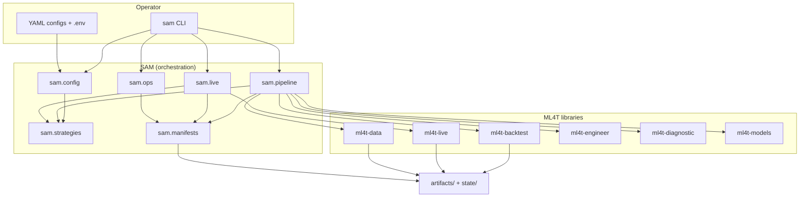
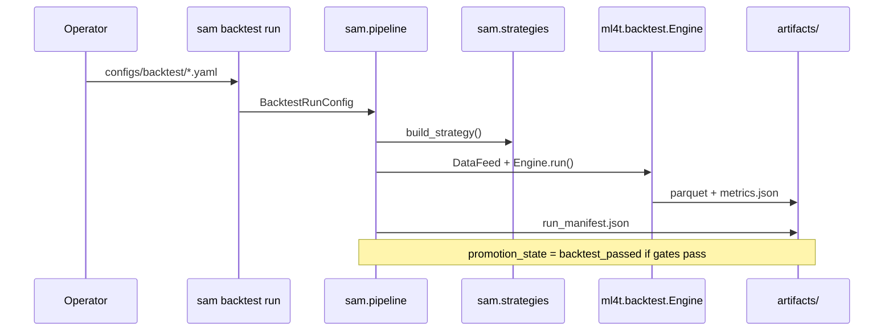
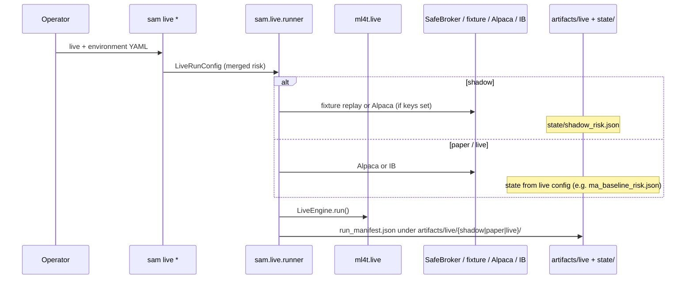
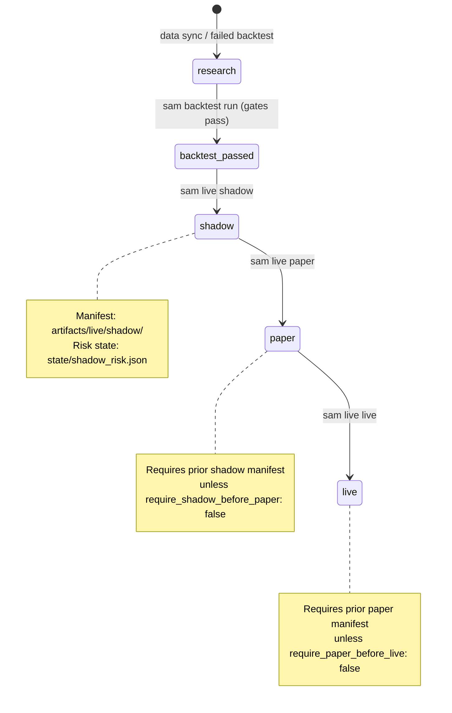

# SAM Architecture

SAM is a thin orchestration layer over [ML4T](https://github.com/orgs/ml4t/repositories). **SAM orchestrates; ML4T computes, validates, backtests, and executes.** A single `Strategy` subclass is shared by `ml4t.backtest.Engine` and `ml4t.live.LiveEngine`.

## System context



## Layers

| Layer | Package | Responsibility |
|-------|---------|----------------|
| CLI | `sam.cli` | Argument parsing; dispatch to pipeline, live, research, ops |
| Config | `sam.config` | YAML + `SamSettings` (paths, API keys); no quant logic |
| Strategies | `sam.strategies` | Signal and rule implementations registered for backtest/live |
| Pipeline | `sam.pipeline` | Data sync/validate, backtest runs, research steps |
| Live | `sam.live` | `LiveEngine` + `SafeBroker` + feeds (fixture replay, Alpaca, IB) |
| Manifests | `sam.manifests` | `run_manifest.json` — promotion state, hashes, artifact paths |
| Ops | `sam.ops` | Status, brief, kill-switch, explicit `sam ops promote` |

## Request flow (backtest)



## Request flow (live)



## Promotion lifecycle

Stages are recorded in `run_manifest.json`. Most transitions are **automatic** when a command completes; operators can also advance state explicitly with `sam ops promote`.



| Stage | Typical command | Manifest location |
|-------|-----------------|-------------------|
| `research` | `sam data sync`, failed backtest | `data/.../run_manifest.json` |
| `backtest_passed` | `sam backtest run` (checks passed) | `artifacts/backtest/<run>/` |
| `shadow` | `sam live shadow` | `artifacts/live/shadow/` |
| `paper` | `sam live paper` | `artifacts/live/paper/` |
| `live` | `sam live live` | `artifacts/live/live/` |

Explicit promotion (e.g. after manual review):

```bash
sam ops promote --from research --to backtest_passed \
  --manifest artifacts/backtest/ma_baseline/run_manifest.json
```

## Repository layout

```
sam/
├── configs/          # backtest, live, data, environments, strategies, universes
├── deploy/           # launchd/cron examples
├── docs/             # ARCHITECTURE.md, RUNBOOK.md
├── scripts/          # fixture generation
├── src/sam/          # package source
├── tests/            # unit + integration (fixtures under tests/fixtures/)
├── artifacts/        # gitignored — run outputs
├── data/             # gitignored — synced market data
└── state/            # gitignored — risk / kill-switch JSON
```

## Realism controls

Backtest configs declare calendar, timezone, data frequency, commission, slippage, data window, corporate-action assumption, signal lag, and promotion gates. Live configs declare exposure, loss, order-rate, data-staleness, drawdown, and kill-switch limits before wiring into `ml4t.live.LiveRiskConfig`.

## Operator surface

- `sam ops status` — local risk files, manifests, data freshness; optional `--broker-snapshot` (Alpaca when configured).
- `sam ops brief` — markdown/json summary for scheduled checks.
- `sam ops kill-switch` — activate or clear kill-switch on a chosen `state/*.json` file.
- `sam ops preflight` — broker connectivity check via `SafeBroker`.

See [RUNBOOK.md](RUNBOOK.md) for step-by-step promotion and drills.
