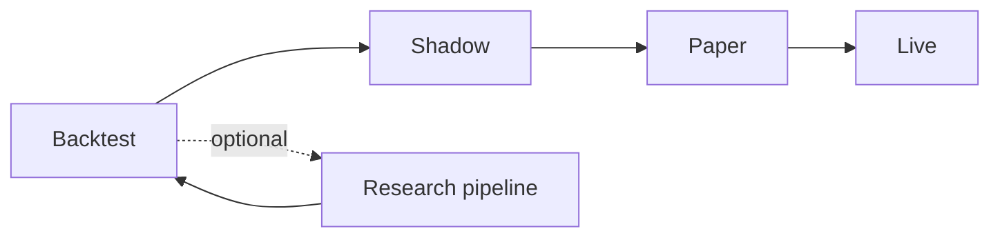

# SAM Runbook

Operator guide for promoting strategies from offline validation to live trading. For system design, see [ARCHITECTURE.md](ARCHITECTURE.md).

## Promotion workflow



| Step | Command | Gate |
|------|---------|------|
| Backtest | `sam backtest run` | Metrics + `run_manifest.json` with `backtest_passed` |
| Shadow | `sam live shadow` | `artifacts/live/shadow/run_manifest.json` |
| Paper | `sam live paper` | Prior shadow manifest (configurable) |
| Live | `sam live live` | Prior paper manifest (configurable) |

## Install

```bash
cd sam
uv sync --extra backtest --extra live --extra data --group dev
cp .env.example .env
uv run python scripts/generate_fixtures.py
```

ML4T packages (`ml4t-data`, `ml4t-backtest`, `ml4t-live`, etc.) install from [PyPI](https://pypi.org/search/?q=ml4t-).
Use local `../ml4t/*` clones only for upstream ML4T development, not for normal SAM installs.

## Promotion checklist

### 1. Backtest (offline)

```bash
sam backtest run --config configs/backtest/ma_baseline.yaml
sam report backtest --output-dir artifacts/backtest/ma_baseline
```

Confirm metrics and `run_manifest.json` show `backtest_passed`.
The manifest should include dependency versions, input hashes, realistic cost settings, and promotion checks.

To record an explicit operator approval after review:

```bash
sam ops promote --from research --to backtest_passed \
  --manifest artifacts/backtest/ma_baseline/run_manifest.json \
  --reason "metrics reviewed"
```

### 2. Shadow (no broker orders)

Uses defaults: `configs/live/ma_baseline.yaml` + `configs/environments/shadow.yaml`.

```bash
sam live shadow --config configs/live/ma_baseline.yaml \
  --environment configs/environments/shadow.yaml --duration 30
```

Verify virtual positions update. Shadow always writes risk state to **`state/shadow_risk.json`** (overrides `state_file` in the live config). Manifest: `artifacts/live/shadow/run_manifest.json`.

Preview strategy orders before connecting to a broker:

```bash
sam live preview --config configs/strategies/ma_crossover.yaml --bars 20
```

### 3. Paper (Alpaca)

Set `ALPACA_API_KEY` and `ALPACA_SECRET_KEY` in `.env`.

```bash
sam ops preflight --config configs/live/ma_baseline.yaml
sam live paper --config configs/live/ma_baseline.yaml --duration 95
```

Start with low `max_order_value` and `max_position_value` in `configs/live/ma_baseline.yaml`.
Paper uses **`state/ma_baseline_risk.json`** per live config.
`sam live paper` requires a prior shadow manifest unless `require_shadow_before_paper: false`.

### 4. Live (Alpaca)

Only after sustained paper validation. Merge `configs/environments/live.yaml` for tightened limits and live API keys.

```bash
sam live live --config configs/live/ma_baseline.yaml \
  --environment configs/environments/live.yaml
```

`sam live live` requires a prior paper manifest unless `require_paper_before_live: false`.

### 5. Interactive Brokers (optional)

Requires TWS or IB Gateway on port 7497 (paper):

```bash
sam live ib --config configs/live/ib_ma_baseline.yaml --duration 75
```

## Data operations

**Sync (network, Yahoo by default):**

```bash
sam data sync --config configs/data/default.yaml
```

**Validate offline (committed fixtures, no network):**

```bash
sam data validate --config configs/data/validate_fixtures.yaml
```

The CLI default for `sam data validate` is `configs/data/default.yaml`, which expects data under `SAM_DATA_DIR`; use `validate_fixtures.yaml` in CI and local smoke checks.

## Kill switch drill

1. Run shadow or paper session.
2. Inspect risk JSON:
   - Shadow: `state/shadow_risk.json`
   - Paper/live (ma baseline): `state/ma_baseline_risk.json`
3. Activate the local operator kill switch (example for paper config):

```bash
sam ops kill-switch --activate --reason drill --state-file state/ma_baseline_risk.json
sam ops status --json
sam ops kill-switch --clear --state-file state/ma_baseline_risk.json
```

4. Confirm `sam ops status` reflects blocked state after a simulated breach (see ml4t-live risk guard documentation).

## Operator status

```bash
sam ops status
sam ops status --json
sam ops status --broker-snapshot
sam ops brief --format md
```

Default status is offline-safe and reads local state, run manifests, and data freshness. `--broker-snapshot` connects to Alpaca when credentials are configured.

## Scheduled ops

Example cron (data refresh before session):

```cron
0 6 * * 1-5 cd /path/to/sam && uv run sam data sync --config configs/data/default.yaml
```

Data sync writes `sync_manifest.json` and `run_manifest.json` under `data/<output_subdir>/`, including ML4T `quality_reports` and `market_data_spec.yaml`.

### Logs

SAM emits structured logs to stderr. Use text mode locally (default) or JSON for production:

```bash
export SAM_LOG_FORMAT=json
sam backtest run --config configs/backtest/ma_baseline.yaml 2>&1 | jq .
grep '"event":"data.sync.complete"' /var/log/sam.log
```

See `deploy/launchd/com.sam.datasync.plist.example` for macOS.
